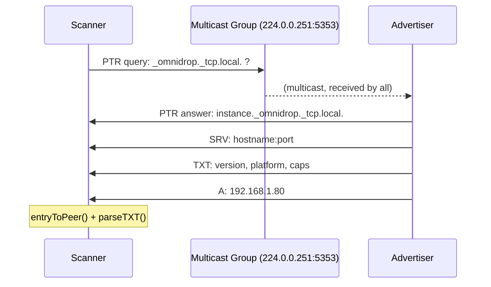

# omnidrop-discover

**LAN peer discovery via mDNS** — a hands-on project for learning Go and networking fundamentals.

Two machines on the same WiFi/LAN can find each other without a central server, a QR code, or typing in IP addresses. One runs `--serve` to advertise itself, the other runs `--scan` to find it.

```
Machine A:  go run . --serve
Machine B:  go run . --scan
            → "peer discovered: Adrians-MacBook-Air (192.168.1.80:9000)"
```

---

## Quick start

```sh
# Terminal 1 — advertise this machine
go run ./cmd/omnidrop-discover --serve

# Terminal 2 — find it (same machine, or another on the LAN)
go run ./cmd/omnidrop-discover --scan

# Probe a specific host directly (bypass mDNS)
go run ./cmd/omnidrop-discover --probe 192.168.1.80:9000

# JSON output + verbose logging
go run ./cmd/omnidrop-discover --scan --json --verbose
```

```
USAGE:
  --serve          Advertise this instance via mDNS
  --scan           Scan LAN for omnidrop instances
  --probe addr     Probe a specific host:port directly
  --port int       Port to advertise/probe (default 9000)
  --timeout dur    Scan timeout (default 8s)
  --json           Output peers as JSON
  --verbose        Debug-level logging
  --log-json       JSON-formatted logs
```

---

## Project structure

```
omnidrop-discover/
├── cmd/
│   └── omnidrop-discover/
│       ├── main.go           # Entry point: flag parsing, signal handling, mode dispatch
│       └── logging.go        # Structured logger factory (slog)
├── internal/
│   └── discovery/
│       ├── discovery.go      # Package doc & shared constants
│       ├── peer.go           # Peer type, thread-safe store, TXT parsing
│       ├── serve.go          # mDNS advertising (zeroconf.Register)
│       ├── scan.go           # mDNS browsing (zeroconf.Browse)
│       ├── banner.go         # TCP banner server + direct probe client
│       └── interfaces.go     # Network interface helpers
├── go.mod
└── go.sum
```

The `cmd/` + `internal/` layout is the standard Go project structure:

- **`cmd/`** — one directory per binary. Each is `package main` and as thin as possible — just parse flags, set up logging, call into the library.
- **`internal/`** — private library code. Packages inside `internal/` can only be imported by code within the module tree. This is Go's mechanism for enforcing "this is an implementation detail, don't depend on it from outside."

---

## Networking concepts (what I learned)

### mDNS (Multicast DNS) — RFC 6762

Normal DNS works by asking a server: "what IP does `google.com` have?" You send a **unicast** query to a known server (e.g. 8.8.8.8) and it replies.

mDNS flips this: you ask the **local network** by sending a **multicast** packet to `224.0.0.251:5353` (the mDNS well-known address). Every device on the LAN receives it. If a device knows the answer, it replies.

```
Normal DNS:     you ──unicast──→ DNS server ──unicast──→ you
mDNS:           you ──multicast→ 224.0.0.251:5353
                    ←─unicast── device-that-knows
                    ←─unicast── another-device
```

Key properties:
- **No setup** — no server to configure. It's built into macOS (Bonjour), Windows, Linux (Avahi), and most printers/IoT devices.
- **Link-local only** — multicast packets are not forwarded by routers, so mDNS only works within the same broadcast domain (one LAN/WiFi network).
- **Best-effort** — multicast UDP is unreliable. Your query might be dropped. That's why we use a default 8-second scan timeout: the zeroconf library retries after 4 seconds.

### DNS-SD (DNS Service Discovery) — RFC 6763

mDNS tells you "machine X is at IP Y". DNS-SD adds: "machine X offers service `_omnidrop._tcp` on port 9000, with metadata version=0.1.0."

Service types follow the pattern `_<name>._<protocol>`. Ours is `_omnidrop._tcp`. The DNS records used:

| Record | Purpose | Example |
|--------|---------|---------|
| **PTR** | Maps service type → instance names | `_omnidrop._tcp.local. → Adrians-MacBook-Air._omnidrop._tcp.local.` |
| **SRV** | Maps instance → hostname + port | `Adrians-MacBook-Air._omnidrop._tcp.local. → adrians-macbook-air.local.:9000` |
| **TXT** | Key-value metadata (max 255 bytes each) | `version=0.1.0`, `platform=darwin/arm64`, `caps=files,folders` |
| **A/AAAA** | Hostname → IP address | `adrians-macbook-air.local. → 192.168.1.80` |

The scan flow:



But here's the catch: mDNS responses often don't include all records in a single packet. The zeroconf library buffers and assembles them. It only submits an entry to our channel once IP addresses are resolved.

### Multicast vs Unicast

| | Unicast | Multicast |
|---|---|---|
| **One-to-one** | One sender, one receiver | One sender, many receivers |
| **Efficiency** | N queries for N devices | 1 query reaches N devices |
| **Router behavior** | Routed everywhere | Blocked at subnet boundary |
| **Reliability** | TCP retransmits lost packets | UDP — packet may be lost silently |
| **Use case** | Browsing the web | LAN discovery, streaming video |

When you run `--scan`, the zeroconf library sends a multicast UDP packet to `224.0.0.251:5353`. All devices on the LAN receive it. Only omnidrop instances respond.

### The banner protocol (TCP)

mDNS TXT records are limited to 255 bytes per string. For richer metadata, we run a **TCP banner server** on the same port. When `ProbePeer` connects, the server writes one line of JSON and closes:

```
Scanner                        Advertiser
   │                               │
   │──── TCP connect :9000 ───────→│
   │←─── {"instance":"...", ...} ──│
   │←─── (connection closed) ──────│
```

Why both mDNS and TCP banner?
- **mDNS** gives you zero-config discovery — no IP needed, just `--scan`.
- **TCP banner** gives you richer, more reliable data (no 255-byte limit, no truncation).
- Together: find hosts via mDNS, then optionally probe them for full metadata.

---

## Go concepts (what I learned)

### Packages and imports

Every `.go` file starts with `package <name>`. Files in the same directory are part of the same package and can share unexported names.

```
internal/discovery/  →  package discovery
cmd/omnidrop-discover/  →  package main
```

- **`package main`** is special — it tells Go to build a binary (not a library). It must have a `func main()`.
- **Exported vs unexported**: Capitalized names (`RunServe`, `Peer`) are visible outside the package. Lowercase names (`peerStore`, `entryToPeer`) are private to the package.

Import paths are module-relative:

```go
import "github.com/adriel-meb/omnidrop-discover/internal/discovery"
```

### `go.work` vs `replace` directives

Not needed here — a single `go.mod` at the root describes the whole module. All packages inside resolve relative to the module path.

### Context for cancellation and deadlines

`context.Context` is Go's standard way to propagate cancellation signals and timeouts through API boundaries.

```
main()                        runScan()
  │                              │
  │── signal.NotifyContext() ──→ │
  │                              ├── context.WithTimeout(8s)
  │                              │      ↓
  │                              │   resolver.Browse(browseCtx, ...)
  │                              │      ↓
  │                              │   zeroconf's mainloop(ctx)
```

When you press Ctrl+C:
1. `signal.NotifyContext` cancels the root `ctx`
2. That cancellation propagates to `browseCtx` (the timeout context)
3. `resolver.Browse` sees `browseCtx.Done()` and shuts down its mainloop
4. The entries channel is closed
5. Our consumer goroutine exits
6. The program returns cleanly

### Goroutines and channels

The scan flow uses two goroutines communicating over a channel:

```go
entries := make(chan *zeroconf.ServiceEntry)
done := make(chan struct{})

// Goroutine 1: consumer — converts entries to peers
go func() {
    defer close(done)
    for entry := range entries {  // blocks until entries is closed
        p := entryToPeer(entry)
        store.addOrUpdate(p)
    }
}()

// Main goroutine: start browsing
resolver.Browse(ctx, ..., entries)  // spawns more goroutines internally
<-browseCtx.Done()                  // wait for timeout
<-done                              // wait for consumer to finish
```

Key points:
- `entries` is **unbuffered** — each send blocks until a receive happens. This creates backpressure: the zeroconf library won't send faster than we can process.
- `range entries` reads until the channel is closed. Closing is done by the zeroconf library when the browse context is cancelled.
- `done` is a **signalling channel** — `struct{}` takes zero memory. `close(done)` unblocks `<-done` in the main goroutine, ensuring we don't print results before the last entry is processed.

### `sync.Mutex` for safe concurrent access

The `peerStore` is accessed from the consumer goroutine (writing) and the main goroutine (reading after `<-done`). To be safe, writes are mutex-protected:

```go
type peerStore struct {
    mu    sync.Mutex
    peers map[string]Peer
}

func (s *peerStore) addOrUpdate(p Peer) {
    s.mu.Lock()
    defer s.mu.Unlock()
    // ... map write ...
}

func (s *peerStore) snapshot() []Peer {
    s.mu.Lock()
    defer s.mu.Unlock()
    // ... map read ...
}
```

`defer s.mu.Unlock()` ensures the mutex is released even if the function panics. In practice, after `<-done` we know the consumer is done, so no concurrent writes happen — but the mutex makes the code correct *by construction* rather than *by timing accident*.

### `log/slog` — structured logging

The standard library's `slog` package (added in Go 1.21) provides key-value structured logging:

```go
slog.Info("peer discovered",
    "instance", p.Instance,
    "ipv4", p.IPv4,
    "port", p.Port,
)
```

Benefits over `fmt.Println`:
- Output is machine-parseable (JSON mode with `--log-json`)
- Levels: `Debug`, `Info`, `Warn`, `Error`
- The handler can be swapped globally with `slog.SetDefault()`

### `net.Interface` flags

`net.Interface` has a `Flags` field that's a bitmask of `net.Flag*` constants:

```go
if iface.Flags&net.FlagUp == 0 {
    continue // interface is down
}
```

Bitwise AND with the flag mask tests whether the flag is set. This is the classic C pattern for working with bitmask enums.

### JSON encoding/decoding

The `encoding/json` package uses struct tags to control field names:

```go
type Peer struct {
    Instance string   `json:"instance"`
    IPv4     []string `json:"ipv4,omitempty"` // omitted when empty
}
```

- `json.NewEncoder(os.Stdout).Encode(v)` — streams JSON directly, no intermediate buffer
- `json.Marshal(v)` — returns `[]byte` (used for the banner)
- `json.Unmarshal(data, &v)` — parses into a struct

### Error wrapping with `%w`

```go
return fmt.Errorf("registering service: %w", err)
```

`%w` wraps the error so callers can use `errors.Is()` or `errors.As()` to inspect the original error. Use `%v` when you don't need unwrapping.

---

## What I'd add next

Ideas for extending the project:

- **Resolve hostnames**: mDNS gives you hostnames like `adrians-macbook-air.local.` — resolve them with `net.LookupHost()` or manually via A/AAAA records.
- **Service registry**: Persistent list of known peers with last-seen timestamps.
- **File transfer**: The `caps` TXT field hints at capabilities — add actual file exchange over TCP.
- **NAT traversal**: mDNS doesn't cross subnets. Experiment with a relay or DHT for WAN discovery.
- **GUI**: `fyne` or `gio` for a desktop app that shows discovered peers.
- **Service announcement on WiFi change**: Listen for network changes with `syscall` or a third-party notifier.

---

## References

- [RFC 6762 — Multicast DNS](https://datatracker.ietf.org/doc/html/rfc6762)
- [RFC 6763 — DNS-Based Service Discovery](https://datatracker.ietf.org/doc/html/rfc6763)
- [grandcat/zeroconf](https://github.com/grandcat/zeroconf) — the Go library this project builds on
- [Go by Example: Channels](https://gobyexample.com/channels)
- [Go by Example: Mutexes](https://gobyexample.com/mutexes)
- [Go blog: Context](https://go.dev/blog/context)
- [Go blog: Using Go Modules](https://go.dev/blog/using-go-modules)
