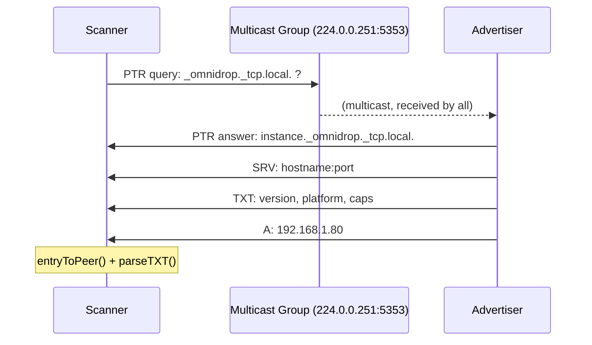
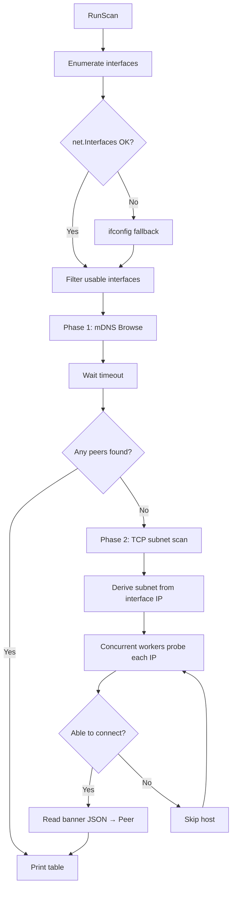

<h1 align="center">
  omnidrop-discover
</h1>

<p align="center">
  <strong>LAN peer discovery via mDNS</strong> — a hands-on project for learning Go and networking fundamentals.
</p>

<p align="center">
  
  
  
</p>

---

Two machines on the same WiFi/LAN find each other without a central server, a QR code, or typing in IP addresses. One runs `--serve` to advertise, the other runs `--scan` to discover.

```text
 15:04:05 │ [DONE] advertising service  · instance=Adriels-MacBook-Air  · type=_omnidrop._tcp  · port=9000
```

```text
 15:04:05 │ [DONE] peer discovered  · instance=Adriels-MacBook-Air  · ipv4=192.168.1.80  · port=9000  · platform=darwin

╭───────────────────────────────────────────────────────────────────────╮
│  INSTANCE                    IPV4              PORT  PLATFORM  VERSION │
├───────────────────────────────────────────────────────────────────────┤
│  Adriels-MacBook-Air…  192.168.1.80      9000  darwin    0.1.0 │
╰───────────────────────────────────────────────────────────────────────╯
  ◆ 1 peer discovered
```

---

## Table of Contents

- [Quick Start](#quick-start)
- [What You'll Learn](#what-youll-learn)
- [Project Structure](#project-structure)
- [Networking Concepts](#networking-concepts)
  - [Unicast vs Multicast](#unicast-vs-multicast)
  - [mDNS — Multicast DNS](#mdns--multicast-dns)
  - [DNS-SD — Service Discovery](#dns-sd--service-discovery)
  - [The Banner Protocol](#the-banner-protocol)
- [Go Concepts](#go-concepts)
  - [Project Layout: `cmd/` + `internal/`](#project-layout-cmd--internal)
  - [Context for Cancellation](#context-for-cancellation)
  - [Goroutines and Channels](#goroutines-and-channels)
  - [sync.Mutex for Safe Concurrency](#syncmutex-for-safe-concurrency)
  - [Structured Logging with slog](#structured-logging-with-slog)
  - [Error Wrapping with %w](#error-wrapping-with-w)
  - [Custom slog Handler](#custom-slog-handler)
  - [ANSI Terminal Colors](#ansi-terminal-colors)
- [Android Compatibility](#android-compatibility)
- [Flags Reference](#flags-reference)
- [Next Steps / Exercises](#next-steps--exercises)
- [License](#license)

---

## Quick Start

### Prerequisites

- **Go 1.21+** ([install](https://go.dev/dl/)) — the `log/slog` package requires Go 1.21.
- Two devices on the **same WiFi/LAN** network.

### 1. Clone the repo

```bash
git clone https://github.com/adriel-meb/omnidrop-discover
cd omnidrop-discover
```

### 2. Advertise (Machine A)

```bash
go run ./cmd/omnidrop-discover --serve
```

You'll see:

```text
 15:04:05 │ [DONE] advertising service  · instance=Adriels-MacBook-Air  · type=_omnidrop._tcp  · port=9000  · version=0.1.0  platform=darwin
```

Leave this running. Press Ctrl+C to stop.

### 3. Scan (Machine B)

On another machine on the same network:

```bash
go run ./cmd/omnidrop-discover --scan
```

```text
 15:04:05 │ [DONE] peer discovered  · instance=Adriels-MacBook-Air  · ipv4=192.168.1.80  · port=9000  · platform=darwin

╭───────────────────────────────────────────────────────────────────────╮
│  INSTANCE                    IPV4              PORT  PLATFORM  VERSION │
├───────────────────────────────────────────────────────────────────────┤
│  Adriels-MacBook-Air…  192.168.1.80      9000  darwin    0.1.0 │
╰───────────────────────────────────────────────────────────────────────╯
  ◆ 1 peer discovered
```

### 4. Probe (bypass mDNS)

If you already know the IP address, use `--probe` to connect directly via TCP:

```bash
go run ./cmd/omnidrop-discover --probe 192.168.1.80:9000
```

```json
{
  "instance": "Adriels-MacBook-Air",
  "host": "192.168.1.80",
  "port": 9000,
  "ipv4": ["192.168.1.80"],
  "version": "0.1.0",
  "platform": "darwin",
  "caps": ["files", "folders"]
}
```

### 5. JSON output + verbose logging

```bash
go run ./cmd/omnidrop-discover --scan --json --verbose
```

---

## What You'll Learn

| Area | Concepts |
|------|----------|
| **Networking** | mDNS (RFC 6762), DNS-SD (RFC 6763), multicast vs unicast, TCP banner protocol, port scanning, subnet calculation, netlink vs ioctl vs procfs |
| **Go** | Packages & imports, `context.Context` for cancellation/timeouts, goroutines & channels, `sync.Mutex`, `log/slog` structured logging, `encoding/json`, `net.Interface` flags, error wrapping, custom `slog.Handler`, ANSI terminal color codes |
| **Cross-platform** | Android/Termux compatibility, interface enumeration fallbacks, permission handling, `exec.Command` for system tools |

---

## Project Structure

```
omnidrop-discover/
├── cmd/
│   └── omnidrop-discover/
│       ├── main.go           # Entry point: flags, logging, signal handling, mode dispatch
│       └── logging.go        # Custom slog handler with ANSI colors + badges
├── internal/
│   └── discovery/
│       ├── discovery.go      # Package documentation & shared constants
│       ├── peer.go           # Peer type, thread-safe store, TXT parsing, results table
│       ├── serve.go          # mDNS advertising via zeroconf.Register
│       ├── scan.go           # mDNS scanning + TCP subnet fallback
│       ├── banner.go         # TCP banner server + direct probe client
│       └── interfaces.go     # Network interface enumeration with Android fallbacks
├── .gitignore
├── go.mod
├── go.sum
├── Makefile                  # Convenience commands
└── README.md
```

### File-by-file explanation

#### `cmd/omnidrop-discover/main.go`

The **entry point** of the binary. It does three things:

1. **Parses CLI flags** using Go's `flag` standard library
2. **Sets up the logger** — the modern colorized handler (or JSON, if `--log-json`)
3. **Dispatches to the right mode** — `RunServe`, `RunScan`, or `ProbePeer`

It also sets up **signal handling** via `signal.NotifyContext` so that pressing Ctrl+C cleanly cancels the context, which propagates to all goroutines.

```go
ctx, stop := signal.NotifyContext(context.Background(),
    os.Interrupt, syscall.SIGTERM)
defer stop()
```

#### `cmd/omnidrop-discover/logging.go`

A **custom `slog.Handler`** that replaces Go's default `slog.TextHandler`. It:

- Formats each log line as: `15:04:05 │ [BADGE] message · key=val · key=val`
- Uses **colored badges** instead of plain text level labels:
  - `[DONE]` — green background
  - `[WARN]` — yellow background
  - `[FAIL]` — red background
  - `[DEBUG]` — cyan background
- The message text is colorized to match the badge
- Attributes are separated by `·` (middle dot) for clean scanning
- Keys are dimmed, values are bright

This is a great example of implementing the `slog.Handler` interface.

#### `internal/discovery/discovery.go`

The **package doc** for the `discovery` package. It defines the shared constants:

- `serviceType = "_omnidrop._tcp"` — the DNS-SD service type
- `serviceDomain = "local."` — mDNS link-local domain
- `appVersion = "0.1.0"` — advertised version string

#### `internal/discovery/peer.go`

Defines:

- **`Peer`** — the data structure for a discovered instance
- **`peerStore`** — a concurrency-safe collection with `addOrUpdate` and `snapshot` methods
- **`entryToPeer`** — converts a `zeroconf.ServiceEntry` to our `Peer` type
- **`parseTXT`** — extracts `version`, `platform`, and `caps` from TXT records
- **`PrintPeersTable`** — renders the box-drawn results table with alternating row colors

#### `internal/discovery/serve.go`

The **advertising mode** (`--serve`). It:

1. Starts a **TCP banner server** on the specified port (background goroutine)
2. Registers the service via **`zeroconf.Register`** — this sends mDNS multicast announcements and responds to queries
3. Blocks until Ctrl+C

When shutting down, `server.Shutdown()` sends a **"goodbye" packet** (TTL=0) so other machines' caches are flushed.

#### `internal/discovery/scan.go`

The **scanning mode** (`--scan`). It uses a **two-phase approach**:

- **Phase 1 — mDNS**: creates a zeroconf resolver, browses for `_omnidrop._tcp`, waits for the timeout
- **Phase 2 — TCP subnet scan** (fallback): if mDNS finds nothing, probes each IP on the local subnet via direct TCP (useful on Android where incoming multicast is often blocked)

The subnet scan uses a **concurrent worker pool** (20 goroutines, 500ms timeout per host) to scan a `/24` subnet in ~6 seconds.

It also includes `subnetHosts()` which computes all usable host IPs from a network address and subnet mask — a great illustration of IP math.

#### `internal/discovery/banner.go`

Implements two sides of the **TCP banner protocol**:

- **`startBannerServer`** — accepts TCP connections and writes a JSON banner, then closes
- **`ProbePeer`** — connects to a `host:port`, reads the JSON banner, returns a `Peer`

This is the "out-of-band" data channel that bypasses the mDNS TXT record size limit (255 bytes).

#### `internal/discovery/interfaces.go`

The **interface enumeration** module. It uses a **three-tier fallback chain** to handle restricted platforms like Android:

| Tier | Method | Mechanism | Works on |
|------|--------|-----------|----------|
| 1 | `net.Interfaces()` | Netlink socket | Desktop (macOS, Linux, Windows) |
| 2 | `ifconfig` (exec) | `ioctl` syscall | Most Android devices |
| 3 | `net.InterfaceByName()` | `ioctl` (per-interface) | Restricted environments |

It also caches the `ifconfig` output so that `InterfaceAddr()` can extract IP/netmask without calling `iface.Addrs()` (which also uses netlink on Linux).

---

## Networking Concepts

### Unicast vs Multicast

| | Unicast | Multicast |
|---|---|---|
| **One-to-one** | One sender, one receiver | One sender, many receivers |
| **Efficiency** | N queries for N devices | 1 query reaches N devices |
| **Router behavior** | Routed everywhere | Blocked at subnet boundary |
| **Reliability** | TCP retransmits lost packets | UDP — packet may be lost silently |
| **Use case** | Browsing the web | LAN discovery, streaming video |

### mDNS — Multicast DNS

**Normal DNS** works by asking a server: "what IP does `google.com` have?" You send a **unicast** query to a known server (e.g. `8.8.8.8`) and it replies.

**mDNS** flips this: you ask the **local network** by sending a **multicast** packet to `224.0.0.251:5353` (the well-known mDNS address). Every device on the LAN receives it. If a device knows the answer, it replies.

```
Normal DNS:     you ──unicast──→ DNS server ──unicast──→ you
mDNS:           you ──multicast→ 224.0.0.251:5353
                    ←─unicast── device-that-knows
                    ←─unicast── another-device
```

Key properties:
- **No setup** — no server to configure. Built into macOS (Bonjour), Windows, Linux (Avahi).
- **Link-local only** — multicast packets don't cross routers, so mDNS only works within one LAN.
- **Best-effort** — multicast UDP is unreliable. Queries can be dropped. The zeroconf library retries after 4 seconds.

### DNS-SD — Service Discovery

mDNS tells you "machine X is at IP Y". **DNS-SD** adds: "machine X offers service `_omnidrop._tcp` on port 9000, with metadata `version=0.1.0`."

Service types follow the pattern `_<name>._<protocol>`. Ours is `_omnidrop._tcp`.



The DNS records used:

| Record | Purpose | Example |
|--------|---------|---------|
| **PTR** | Maps service type → instance names | `_omnidrop._tcp.local. → Adriels-MacBook-Air._omnidrop._tcp.local.` |
| **SRV** | Maps instance → hostname + port | `Adriels-MacBook-Air._omnidrop._tcp.local. → adriels-macbook-air.local.:9000` |
| **TXT** | Key-value metadata (max 255 bytes each) | `version=0.1.0`, `platform=darwin/arm64`, `caps=files,folders` |
| **A/AAAA** | Hostname → IP address | `adriels-macbook-air.local. → 192.168.1.80` |

### The Banner Protocol

mDNS TXT records are limited to **255 bytes per string**. For richer metadata, we run a **TCP banner server** on the same port:

```
Scanner                        Advertiser
   │                               │
   │──── TCP connect :9000 ───────→│
   │←─── {"instance":"...", ...} ──│
   │←─── (connection closed) ──────│
```

Why both mDNS **and** TCP banner?
- **mDNS** gives you zero-config discovery — no IP needed, just `--scan`.
- **TCP banner** gives you richer, more reliable data (no 255-byte limit, no truncation).
- Together: find hosts via mDNS, then optionally probe them for full metadata.

### The Scan Flow (Full Picture)



---

## Go Concepts

### Project Layout: `cmd/` + `internal/`

```
omnidrop-discover/
├── cmd/                     # One directory per binary
│   └── omnidrop-discover/   # package main
└── internal/                # Private library code
    └── discovery/           # package discovery
```

- **`cmd/`** — one directory per binary. Each is `package main` and as thin as possible. Just parse flags, set up logging, call into the library.
- **`internal/`** — private library code. Packages inside `internal/` can only be imported by code within the **same module tree**. This is Go's mechanism for enforcing "this is an implementation detail, don't depend on it from outside."

### Exported vs Unexported

Capitalized names are **exported** (public) — visible outside the package:
```go
func RunServe(ctx context.Context, port int) error   // exported
type Peer struct { ... }                              // exported
```

Lowercase names are **unexported** (private) — only visible within the same package:
```go
type peerStore struct { ... }   // private
func entryToPeer(...) Peer      // private
```

### Context for Cancellation

`context.Context` is Go's standard way to propagate cancellation signals and timeouts through API boundaries.

```
main()                        runScan()
  │                              │
  │── signal.NotifyContext() ──→ │
  │                              ├── context.WithTimeout(8s)
  │                              │      ↓
  │                              │   resolver.Browse(browseCtx, ...)
  │                              │      ↓
  │                              │   zeroconf's mainloop(ctx)
```

When you press Ctrl+C:
1. `signal.NotifyContext` cancels the root `ctx`
2. That cancellation propagates to `browseCtx` (the timeout context)
3. `resolver.Browse` sees `browseCtx.Done()` and shuts down
4. The entries channel is closed
5. The consumer goroutine exits
6. The program returns cleanly

```go
ctx, stop := signal.NotifyContext(context.Background(),
    os.Interrupt, syscall.SIGTERM)
defer stop()

browseCtx, cancel := context.WithTimeout(ctx, 8*time.Second)
defer cancel()
// ... pass browseCtx to the library ...
```

### Goroutines and Channels

The scan uses **two goroutines communicating over a channel**:

```go
entries := make(chan *zeroconf.ServiceEntry)
mdnsDone := make(chan struct{})

// Goroutine 1: consumer — converts entries to peers
go func() {
    defer close(mdnsDone)
    for entry := range entries {
        p := entryToPeer(entry)
        store.addOrUpdate(p)
    }
}()

// Main goroutine: start browsing
resolver.Browse(ctx, ..., entries)
<-browseCtx.Done()  // wait for timeout
<-mdnsDone          // wait for consumer to finish
```

Key points:
- `entries` is **unbuffered** — each send blocks until a receive happens. This creates **backpressure**: the library won't send faster than we can process.
- `range entries` reads until the channel is **closed** (done by the library when cancelled).
- `mdnsDone` is a **signalling channel** — `struct{}` takes zero memory. `close(mdnsDone)` unblocks `<-mdnsDone`, ensuring we don't print results before the last entry is processed.

### sync.Mutex for Safe Concurrency

The `peerStore` is accessed from the consumer goroutine (writing) and the main goroutine (reading). To be safe, writes are **mutex-protected**:

```go
type peerStore struct {
    mu    sync.Mutex
    peers map[string]Peer
}

func (s *peerStore) addOrUpdate(p Peer) bool {
    s.mu.Lock()
    defer s.mu.Unlock()
    // ... map write ...
}

func (s *peerStore) snapshot() []Peer {
    s.mu.Lock()
    defer s.mu.Unlock()
    // ... map read ...
}
```

`defer s.mu.Unlock()` ensures the mutex is released even if the function panics.

### Structured Logging with slog

The standard library's `log/slog` package (Go 1.21+) provides key-value structured logging:

```go
slog.Info("peer discovered",
    "instance", p.Instance,
    "ipv4", p.IPv4,
    "port", p.Port,
)
```

Benefits over `fmt.Println`:
- Output is machine-parseable (JSON mode with `--log-json`)
- Levels: `Debug`, `Info`, `Warn`, `Error`
- The handler can be swapped globally with `slog.SetDefault()`

### Custom slog Handler

This project implements a **custom `slog.Handler`** that produces the modern colorized output. The handler must implement three methods:

```go
type Handler interface {
    Enabled(context.Context, Level) bool
    Handle(context.Context, Record) error
    WithAttrs([]Attr) Handler
    WithGroup(string) Handler
}
```

See `logging.go` for the full implementation. Key design decisions:

- **Mutex protection** — `slog.Handler` must be safe for concurrent use
- **`WithAttrs`/`WithGroup`** — return a **clone** with the extra attrs/group, so the original isn't mutated
- **`formatValue`** — uses type switching to format `Duration`, `Time`, `Group`, and other value types differently

### Error Wrapping with %w

```go
return fmt.Errorf("registering service: %w", err)
```

`%w` wraps the error so callers can use `errors.Is()` or `errors.As()` to inspect the original error. Use `%v` when you don't need unwrapping.

### ANSI Terminal Colors

Terminal colors are applied using **ANSI escape codes**:

| Code | Effect |
|------|--------|
| `\033[31m` | Red foreground |
| `\033[32m` | Green foreground |
| `\033[1m` | Bold/bright |
| `\033[2m` | Dim |
| `\033[42m` | Green background |
| `\033[0m` | Reset all attributes |
| `\033[38;5;N` | 256-color foreground |

Example:
```go
func green(s string) string { return "\033[32m" + s + "\033[0m" }
```

The box-drawn table also uses **Unicode box-drawing characters**:
`╭─┬─╮`, `├─┼─┤`, `╰─┴─╯` for rounded corners and `│` for vertical separators.

---

## Android Compatibility

Running `--scan` from **Termux** on Android requires workarounds because Android locks down several system interfaces.

| Problem | Why | Solution |
|---------|-----|----------|
| `netlinkrib: permission denied` | Android blocks netlink socket | Fallback to `ifconfig` (uses `ioctl`, not netlink) |
| Kernel flag bit mismatch | Linux kernel `IFF_MULTICAST`=`0x1000` vs Go's `FlagMulticast`=`0x10` | `kernelFlagsToGo()` conversion function |
| `iface.Addrs()` fails | `Addrs()` uses netlink on Linux | Parse cached ifconfig output for IP/netmask |
| mDNS responses dropped | Android Wi-Fi firmware blocks incoming multicast UDP | Fallback to direct TCP subnet scan |
| `exec.Command("ifconfig")` | Some Android toys don't support `-a` | Try without `-a` first |

The subnet scan fallback automatically detects the local subnet from `wlan0`'s IP and probes every host on port 9000 using 20 concurrent workers.

To run on Android:

```bash
pkg install golang git
git clone https://github.com/adriel-meb/omnidrop-discover
cd omnidrop-discover
go run ./cmd/omnidrop-discover --scan --timeout 1s
# --timeout 1s skips the mDNS wait since it won't work on Android
```

---

## Flags Reference

| Flag | Description | Default |
|------|-------------|---------|
| `--serve` | Advertise this instance via mDNS | — |
| `--scan` | Scan LAN for omnidrop instances | — |
| `--probe addr` | Probe a specific `host:port` directly | — |
| `--port int` | Port to advertise/probe | `9000` |
| `--timeout dur` | Scan timeout (mDNS phase) | `8s` |
| `--json` | Output discovered peers as JSON | — |
| `--verbose` | Enable debug-level logging | — |
| `--log-json` | Output logs as JSON (not colorized text) | — |

---

## Next Steps / Exercises

This is a **learning project** — here are ways to deepen your understanding:

### Easy

- **Try JSON output**: `go run ./cmd/omnidrop-discover --scan --json`
- **Change the port**: `go run ./cmd/omnidrop-discover --serve --port 9001`
- **Shorten the scan timeout**: `go run ./cmd/omnidrop-discover --scan --timeout 2s`

### Medium

- **Add a `--scan-subnet` flag** that skips mDNS entirely and goes straight to TCP probing
- **Implement hostname resolution**: parse the mDNS hostname and resolve it with `net.LookupHost()`
- **Add persistent storage**: save discovered peers to a JSON file with timestamps

### Hard

- **File transfer**: implement a simple file send/receive using the existing TCP port
- **NAT traversal**: experiment with a relay server or DHT for cross-subnet discovery
- **GUI**: wrap the tool in a `fyne` or `gio` desktop application

### Research

- **Read RFC 6762** (Multicast DNS) and **RFC 6763** (DNS-Based Service Discovery)
- **Explore the `grandcat/zeroconf` library** source code — understanding how it joins multicast groups and parses DNS packets
- **Experiment with raw sockets**: use `golang.org/x/net/ipv4` to send/receive multicast packets manually (without the zeroconf library)

---

## References

- [RFC 6762 — Multicast DNS](https://datatracker.ietf.org/doc/html/rfc6762)
- [RFC 6763 — DNS-Based Service Discovery](https://datatracker.ietf.org/doc/html/rfc6763)
- [grandcat/zeroconf](https://github.com/grandcat/zeroconf) — the Go library this project builds on
- [Go by Example: Channels](https://gobyexample.com/channels)
- [Go by Example: Mutexes](https://gobyexample.com/mutexes)
- [Go blog: Context](https://go.dev/blog/context)
- [Go blog: Using Go Modules](https://go.dev/blog/using-go-modules)
- [log/slog package](https://pkg.go.dev/log/slog) — Go's structured logging

---

## License

MIT — freely use, modify, and share. This is a learning project built for educational purposes.
